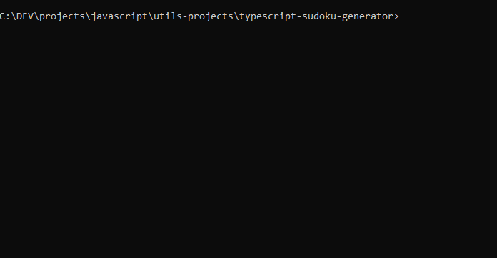

# Sudoku Generator

This is my attempt at creating an algorithm that generates a valid Soduko grid containing all numbers from 1 to 9 in each row, each column, and each 3x3 square of the grid. Each number is unique and is never repeated in any row/col/square. The algorithm takes about 4ms to 6ms to complete.



## Usage

```typescript
import { Sudoku } from "./src/"; // index.ts

const sudoku = new Sudoku();
const grid = sudoku.generate();
console.log(grid);
```

## How it works

The algorithm works by pick & elimination as follows:

- It first starts by generating the first row randomly, giving a foundation for the rest of the proccess.

- At the start of each subsequent row, it generates all the possibilities that can go in each cell of the row as an array of numbers, taking into account the already present numbers in the row, column and the 3x3 square relative to the cell. Each generated possible numbers of each cell are sorted in ascending order. For example, if a cell can only have 5, 1, 3, and 8, it generates [1, 3, 5, 8] as possibilities for that cell.

- Once the possiblites in each cell are generated, they are transformed one by one into a number (int). This allows the algorithm to pick the cell that have the smallest number or the one containing the the less amount of possiblites.

- When the smallest number is picked, the algorithm transforms it back to an array of numbers and picks a number randomly. It does this for the first three cells. On the fourth and up to the last cell, the algorithm picks the the number that occures the least in the possibilities of the rest of the cells in order to avoid exhausting the possibilities in the remaining cells. Once a valid number is picked, it gets eliminated and removed from all the other possibilities so that it's never generated again in any cell of that row.

- While generating rows, the algorithm might sometimes reach an impass where a cell cannot have any possible number in it. In such case, the algorithm will rollback to the previous row and regenerate a new one with different numbers than before. This allows the next row that previously could not have possibilites to start with different ones than before. Although very rarely, this process is repeated if an impass is reached again.

- After generating 9 rows, the process in now complete.

This can therefore yield an infinite amount of valid and randomly generated Sudoku grids.
